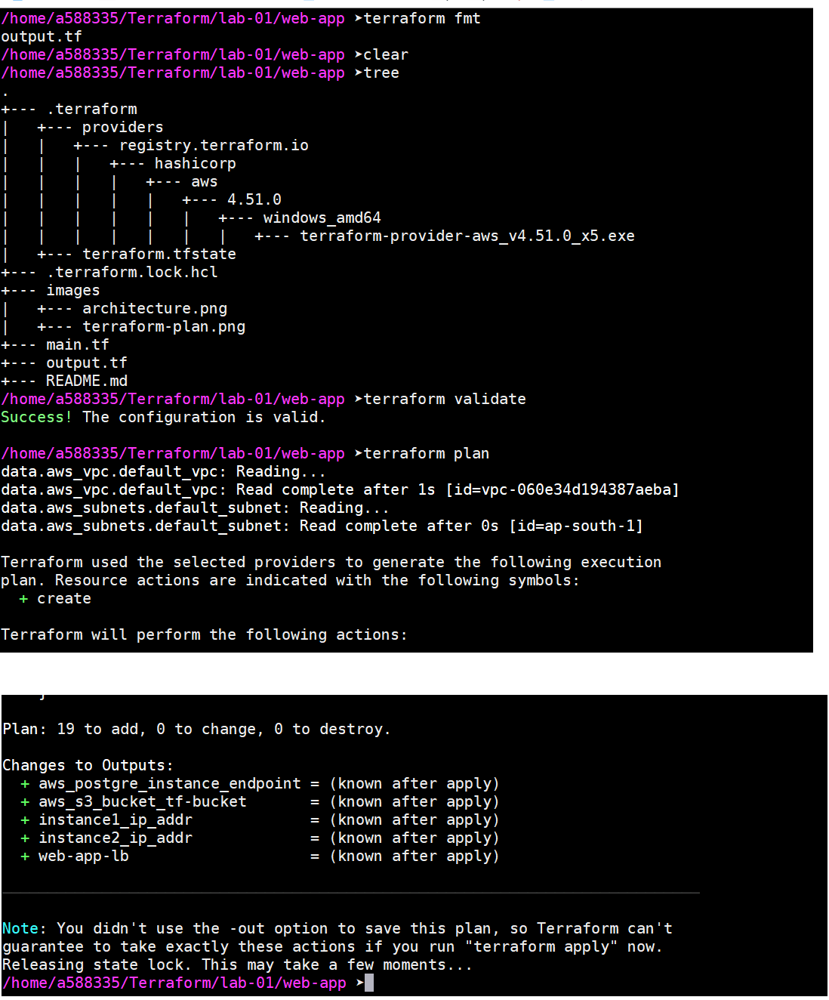

# Web App deployment using Terraform
#### This configuration uses several AWS services like EC2, S3, ELB(Elastic Load Balancer), RDS and Rout53.
##### Its a Practice Lab and credit for code is solely goes to Sid from DevOps Directive https://www.youtube.com/@DevOpsDirective

 

#### Terraform Plan

 

#### Web App Architecture

